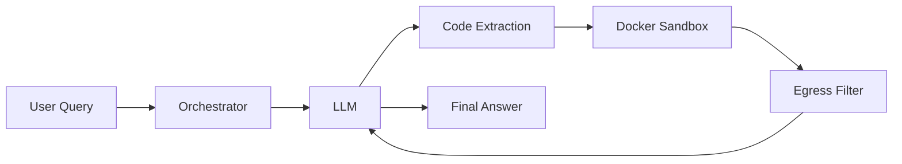

# Orchestrator

The `Orchestrator` is the main class for running LLM-powered code execution loops.

## Overview

The Orchestrator coordinates:

1. Sending queries to the LLM
2. Extracting code blocks from responses
3. Executing code in the Docker sandbox
4. Filtering output through egress controls
5. Returning results to the LLM for iteration



## Basic Usage

```python
from rlm import Orchestrator

orchestrator = Orchestrator()
result = orchestrator.run("What is the square root of 144?")

print(result.final_answer)  # 12.0
print(result.success)       # True
print(result.iterations)    # 1
```

## Configuration

```python
from rlm import Orchestrator
from rlm.core.orchestrator import OrchestratorConfig

config = OrchestratorConfig(
    max_iterations=10,
    system_prompt_mode="full",  # or "simple"
    custom_instructions="Always show your work.",
)

orchestrator = Orchestrator(config=config)
```

## Result Object

```python
@dataclass
class OrchestratorResult:
    final_answer: Optional[str]  # The extracted answer
    success: bool                # Whether execution succeeded
    iterations: int              # Number of LLM calls
    steps: list[ExecutionStep]   # Detailed execution log
    budget_summary: dict         # Cost tracking
    error: Optional[str]         # Error message if failed
```

## Custom LLM Client

```python
from rlm import Orchestrator
from rlm.llm import create_llm_client

# Use a different provider
client = create_llm_client(
    provider="anthropic",
    api_key="sk-ant-...",
    model="claude-3-sonnet-20240229"
)

orchestrator = Orchestrator(llm_client=client)
```

## With Context File

```python
result = orchestrator.run(
    query="Summarize the key findings",
    context_path="/data/research_paper.txt"
)
```

## Simple Chat Interface

For one-off questions without the full result object:

```python
answer = orchestrator.chat("What is 2+2?")
print(answer)  # 4
```
