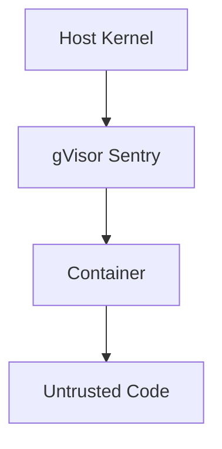

# Security Architecture

RLM v2.0 implements **defense in depth** with multiple security layers.

## Threat Model

### Attack Vectors We Defend Against

| Attack | Description | Mitigation |
|--------|-------------|------------|
| **Network Exfiltration** | Send data to external server | Network isolation |
| **File Access** | Read sensitive system files | Container isolation, volumes |
| **Memory Bomb** | Exhaust host memory | Memory limits (cgroups) |
| **Fork Bomb** | Exhaust host PIDs | PID limits |
| **CPU Mining** | Cryptomining on host CPU | CPU quotas |
| **Container Escape** | Break out of container | gVisor, no privileges |
| **Secret Leakage** | Extract secrets via stdout | Egress filtering |

## Security Layers

### Layer 1: Runtime Isolation



**gVisor (runsc)** runs containers with a user-space kernel that intercepts all syscalls. Even critical kernel vulnerabilities cannot escape the sandbox.

When gVisor is unavailable, we fall back to standard Docker with enhanced security options.

### Layer 2: Network Isolation

```python
# Docker configuration
network_mode = "none"
```

The container has **zero network access**:

- Cannot resolve DNS
- Cannot open sockets
- Cannot reach any IP address

This prevents:
- Data exfiltration via HTTP
- Reverse shells
- DNS tunneling

### Layer 3: Resource Limits

```python
mem_limit = "512m"
memswap_limit = "512m"  # No swap
pids_limit = 50
cpu_quota = 1 core
```

These limits prevent denial-of-service attacks against the host.

### Layer 4: Privilege Restrictions

```python
security_opt = ["no-new-privileges:true"]
ipc_mode = "none"
```

Prevents:
- Privilege escalation via setuid
- Shared memory attacks

### Layer 5: Egress Filtering

Even if code generates output, we filter it for:

- **High entropy** - Potential secrets/keys
- **Known patterns** - AWS keys, JWTs, private keys
- **Context echo** - Raw context printing

## Security Validation

Run the security test suite:

```bash
pytest tests/security/ -v -m security
```

This tests:

| Test | Attack | Expected Result |
|------|--------|-----------------|
| `test_network_blocked` | `socket.connect()` | `OSError: Network unreachable` |
| `test_memory_bomb_killed` | `'a' * 10**9` | OOMKilled, exit 137 |
| `test_sensitive_file_access` | `open('/etc/shadow')` | `PermissionError` |
| `test_subprocess_blocked` | `import subprocess` | `ImportError` |

## Configuration Security Levels

### Maximum Security (Recommended)

```bash
RLM_EXECUTION_MODE=docker
RLM_DOCKER_RUNTIME=runsc  # Requires gVisor
RLM_NETWORK_ENABLED=false
RLM_MEMORY_LIMIT=512m
```

### Standard Security

```bash
RLM_EXECUTION_MODE=docker
RLM_DOCKER_RUNTIME=runc  # Standard Docker
RLM_NETWORK_ENABLED=false
RLM_MEMORY_LIMIT=512m
```

### Development Only (UNSAFE)

```bash
RLM_EXECUTION_MODE=local  # ⚠️ No isolation!
```

!!! danger "Never use `local` mode in production"
    Local mode executes code directly on your system without any isolation.
