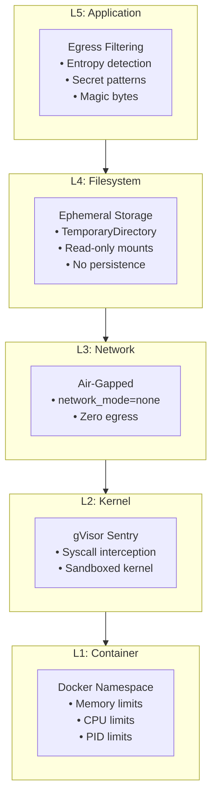

# Security Architecture

RLM-Python implements **Defense in Depth** with 5 security layers.

## The Onion Model



## Layer Details

### L1: Container Isolation (Docker)

Every code execution runs in an **ephemeral Docker container**:

| Resource | Default | Purpose |
|----------|---------|---------|
| Memory | 256MB | Prevent OOM attacks |
| CPU | 0.5 cores | Prevent crypto mining |
| PIDs | 50 | Prevent fork bombs |
| Swap | Disabled | No memory overflow |

```python
# Container automatically configured with:
# - --memory=256m
# - --memory-swap=256m  (no swap)
# - --cpus=0.5
# - --pids-limit=50
# - --security-opt=no-new-privileges
# - --ipc=none
```

### L2: Kernel Interception (gVisor)

[gVisor](https://gvisor.dev/) provides a **user-space kernel** that intercepts syscalls:

```
┌─────────────────────────────────────┐
│         User Application            │
├─────────────────────────────────────┤
│         gVisor Sentry               │  ← Intercepts syscalls
│     (User-space Kernel)             │
├─────────────────────────────────────┤
│      Host Linux Kernel              │  ← Only safe syscalls reach here
└─────────────────────────────────────┘
```

**Blocked syscalls include:**

- `ptrace` (debugging/injection)
- `mount` (filesystem manipulation)
- Low-level networking operations
- Kernel module loading

### L3: Network Isolation

**Network is disabled by default:**

```python
network_mode = "none"  # No network interface in container
```

!!! danger "Enabling Network"
    Network can be enabled via `RLM_NETWORK_ENABLED=1`, but this:
    
    - Allows data exfiltration
    - Enables C2 communication
    - Should NEVER be used in production

### L4: Filesystem Isolation

RLM v3.0 uses **TemporaryDirectory** for crash-safe cleanup:

```python
with tempfile.TemporaryDirectory(prefix="rlm_exec_") as tmpdir:
    script_path = Path(tmpdir) / "user_code.py"
    # Execute...
# Directory auto-deleted even on crash
```

**Volume mounting:**

| Mount | Mode | Purpose |
|-------|------|---------|
| `/opt/rlm_agent_lib` | `ro` | Agent utilities |
| `/tmp/user_code.py` | `ro` | User script |
| `/mnt/context` | `ro` | Context file (optional) |

No writable mounts. No persistence.

### L5: Egress Filtering

The final layer catches **data leaks in output**:

#### Shannon Entropy Detection

High entropy strings indicate secrets:

```python
# Normal text: entropy ~3.5
"Hello, this is a normal message"

# API key: entropy ~5.5 (BLOCKED)
"sk-a1b2c3d4e5f6g7h8i9j0k1l2m3n4o5p6"
```

#### Pattern Matching

Known secret formats are detected:

- AWS Access Keys (`AKIA...`)
- Private Keys (`-----BEGIN RSA...`)
- JWTs (`eyJ...`)
- Bearer Tokens

#### Binary Detection

v3.0 blocks binary output via **magic bytes**:

| Magic | File Type |
|-------|-----------|
| `\x89PNG` | PNG Image |
| `PK\x03\x04` | ZIP Archive |
| `%PDF` | PDF Document |
| `\x7fELF` | Executable |

## Fail-Closed Security

RLM **refuses to run** without gVisor:

```python
from rlm import Orchestrator

agent = Orchestrator()
result = agent.run("print('hello')")
# ❌ SecurityViolationError: gVisor (runsc) not found!
```

To explicitly allow reduced security:

```python
from rlm.core.repl import SandboxConfig

config = SandboxConfig(allow_unsafe_runtime=True)
# ⚠️ Warning logged, execution proceeds with runc
```

## Threat Model

### What RLM Protects Against

| Threat | Protection |
|--------|------------|
| Host filesystem access | L1: Container isolation |
| Network exfiltration | L3: `network_mode=none` |
| Container escape | L2: gVisor syscall filtering |
| Resource exhaustion | L1: Memory/CPU/PID limits |
| Secret leakage | L5: Egress filtering |
| Binary smuggling | L5: Magic byte detection |

### What RLM Does NOT Protect Against

| Threat | Reason |
|--------|--------|
| SIGKILL from kernel | Not catchable |
| Docker daemon compromise | Trust boundary |
| Host network if enabled | User's choice |
| LLM prompt injection | Out of scope |

## Security Checklist

Before deploying to production:

- [ ] gVisor installed and verified
- [ ] `RLM_ALLOW_UNSAFE_RUNTIME=0`
- [ ] `RLM_NETWORK_ENABLED=0`
- [ ] Memory/CPU limits appropriate for workload
- [ ] Docker daemon secured
- [ ] Regular image updates
